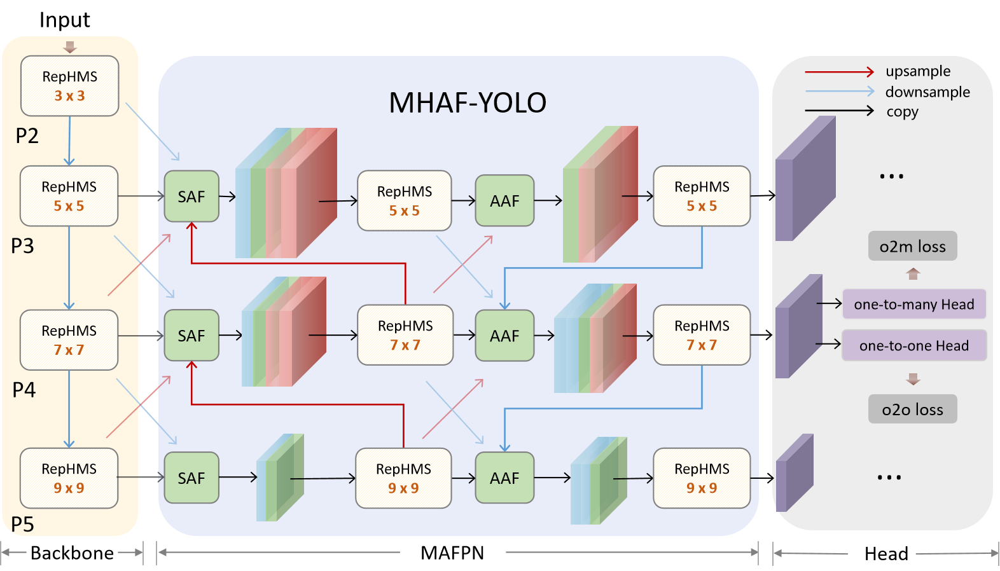
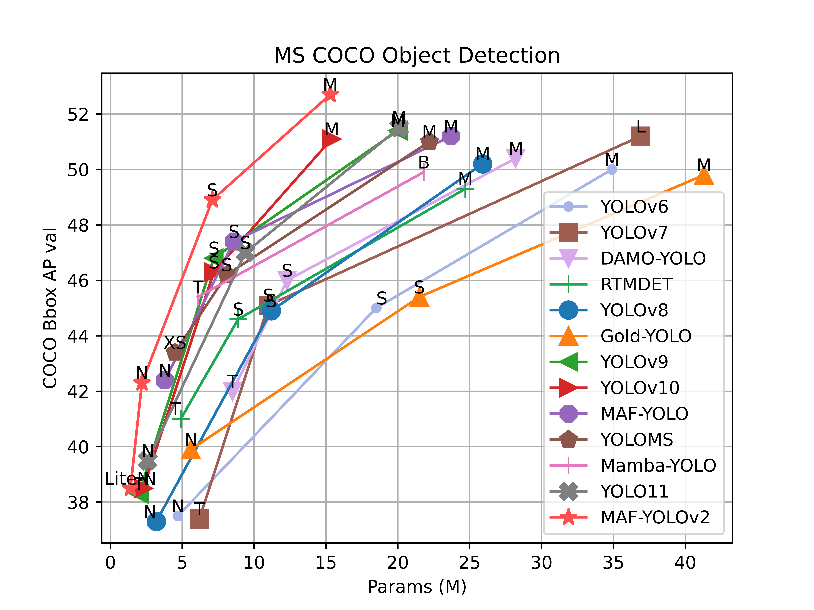
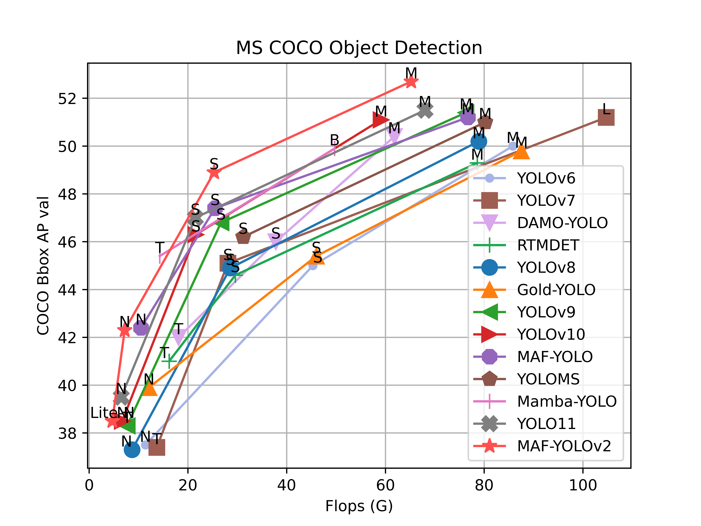

# MHAF-YOLO
We have optimized and designed MAF-YOLOv2(MHAF-YOLO) based on the latest YOLO framework. This model achieves exceptionally high parameter efficiency and has reached state-of-the-art performance among all YOLO variants.

<div align="center">
 <a href="./">
     
</a>
 
</div>

## UPDATES 🔥
- 2025/2/7: Add Paper
- 2025/1/22: Add MAF-YOLOv2-cls, MAF-YOLOv2-seg
- 2024/11/11: Add MAF-YOLOv2
<div align="center">
    <a href="./">
        
        
    </a>
</div>


## Model Zoo
### Detection
MS COCO

| Model             | Test Size | #Params | FLOPs |     AP<sup>val</sup>     |   AP<sub>50</sub><sup>val</sup>    | 
|:------------------|:----:|:-------:|:-----:|:------------------------:|:----------------------------------:|
| [MAF-YOLOv2-Lite-N](https://github.com/yang-0201/MAF-YOLOv2/releases/download/v1.0.0/MAF-YOLOv2-Lite-N.pt) |   640  |  1.4M   | 4.7G  |          38.5%           |               53.7%                |  
| [MAF-YOLOv2-N](https://github.com/yang-0201/MAF-YOLOv2/releases/download/v1.0.0/MAF-YOLOv2-N.pt)      |   640  |  2.2M   | 7.2G  |          42.3%           |               58.5%                | 
| [MAF-YOLOv2-S](https://github.com/yang-0201/MAF-YOLOv2/releases/download/v1.0.0/MAF-YOLOv2-S.pt)      |   640  |  7.1M   | 25.3G |      48.9%      |               65.9%                | 
| [MAF-YOLOv2-M](https://github.com/yang-0201/MAF-YOLOv2/releases/download/v1.0.0/MAF-YOLOv2-M.pt)      |   640  |  15.3M  | 65.2G |      52.7%       |               69.5%                | 

MS COCO with ImageNet Pretrain

| Model             | Test Size | #Params | FLOPs |     AP<sup>val</sup>     |   AP<sub>50</sub><sup>val</sup>    | 
|:------------------|:----:|:-------:|:-----:|:------------------------:|:----------------------------------:|
| [MAF-YOLOv2-N-pretrained](https://github.com/yang-0201/MAF-YOLOv2/releases/download/v1.0.0/MAF-YOLOv2-N-pretrained.pt)      |   640  |  2.2M   | 7.2G  |          43.1%           |               59.3%                | 
| [MAF-YOLOv2-S-pretrained](https://github.com/yang-0201/MAF-YOLOv2/releases/download/v1.0.0/MAF-YOLOv2-S-pretrained.pt)      |   640  |  7.1M   | 25.3G |      49.4%      |               66.5%                | 


### Segmentation
COCO-seg

| Model                                                                                                   | Test Size | #Params | FLOPs | AP<sub>bbox</sub> | AP<sub>mask</sub> | 
|:--------------------------------------------------------------------------------------------------------|:----:|:-------:|:-----:|:-----------------:|:-----------------:|
| [MAF-YOLOv2-N-seg](https://github.com/yang-0201/MHAF-YOLO/releases/download/v1.0.0/MAF-YOLOv2-N-Seg.pt) |   640  |  2.4M   | 14.8G |       42.5%       |       35.0%       | 
| [MAF-YOLOv2-S-seg](https://github.com/yang-0201/MHAF-YOLO/releases/download/v1.0.0/MAF-YOLOv2-S-Seg.pt) |   640  |  7.8M   | 40.4G |       48.8%       |       39.7%       | 

### Classification 
ImageNet

| Model                                                                                                                | size<br><sup>(pixels) | acc<br><sup>top1 | acc<br><sup>top5 | params<br><sup>(M) | FLOPs<br><sup>(G) |
|----------------------------------------------------------------------------------------------------------------------|-----------------------|------------------|------------------|--------------------|-------------------|
| [MAF-YOLOv2-N-cls](https://github.com/yang-0201/MHAF-YOLO/releases/download/v1.0.0/MAF-YOLOv2-N-cls.pt)              | 224                   | 71.2             | 90.3             | 2.8                | 0.4               |
| [MAF-YOLOv2-S-cls](https://github.com/yang-0201/MHAF-YOLO/releases/download/v1.0.0/MAF-YOLOv2-S-cls.pt)              | 224                   | 75.5             | 92.6             | 5.6                | 1.4               |
| [MAF-YOLOv2-N-cls-finetune-384](https://github.com/yang-0201/MHAF-YOLO/releases/download/v1.0.0/MAF-YOLOv2-N-cls-finetune-384.pt) | 384                   | 73.8             | 91.8             | 2.8                | 1.3               |
| [MAF-YOLOv2-S-cls-finetune-384](https://github.com/yang-0201/MHAF-YOLO/releases/download/v1.0.0/MAF-YOLOv2-S-cls-finetune-384.pt) | 384                   | 77.5             | 93.8             | 5.6                | 4.2               |

### Rotated Object Detection
DOTA-v1.0
TBD
## Installation

```
conda create -n mafyolov2 python==3.9
conda activate mafyolov2
pip install torch==2.1.0 torchvision==0.16.0 torchaudio==2.1.0 --index-url https://download.pytorch.org/whl/cu121
pip install -r requirements.txt
pip install -e .
```

## Train
Single GPU training
```python
# train.py
from ultralytics import YOLOv10
if __name__ == '__main__':
    model = YOLOv10('MAF-YOLOv2-n.yaml')
    model.train(data='coco.yaml', batch=16, device=0)

```
## Problems and Improvements
<details><summary>Problems</summary>
<details><summary>Multi-GPU distributed training</summary>
One of the issues with the YOLOv10 framework is that during multi-GPU training, there is a certain probability that the program cannot be completely stopped, requiring manual intervention to kill the process.
</details>
<details><summary>Failed to load some pretrained weights.</summary>
 </details>
</details>

## Citation

If our code or model is helpful to your work, please cite our paper and consider giving us a star. We would be very grateful!
```BibTeX
@InProceedings{10.1007/978-981-97-8858-3_34,
author="Yang, Zhiqiang
and Guan, Qiu
and Zhao, Keer
and Yang, Jianmin
and Xu, Xinli
and Long, Haixia
and Tang, Ying",
editor="Lin, Zhouchen
and Cheng, Ming-Ming
and He, Ran
and Ubul, Kurban
and Silamu, Wushouer
and Zha, Hongbin
and Zhou, Jie
and Liu, Cheng-Lin",
title="Multi-branch Auxiliary Fusion YOLO with Re-parameterization Heterogeneous Convolutional for Accurate Object Detection",
booktitle="Pattern Recognition and Computer Vision",
year="2025",
publisher="Springer Nature Singapore",
address="Singapore",
pages="492--505",
abstract="Due to the effective performance of multi-scale feature fusion, Path Aggregation FPN (PAFPN) is widely employed in YOLO detectors. However, it cannot efficiently and adaptively integrate high-level semantic information with low-level spatial information simultaneously. We propose a new model named MAF-YOLO in this paper, which is a novel object detection framework with a versatile neck named Multi-Branch Auxiliary FPN (MAFPN). Within MAFPN, the Superficial Assisted Fusion (SAF) module is designed to combine the output of the backbone with the neck, preserving an optimal level of shallow information to facilitate subsequent learning. Meanwhile, the Advanced Assisted Fusion (AAF) module deeply embedded within the neck conveys a more diverse range of gradient information to the output layer. Furthermore, our proposed Re-parameterized Heterogeneous Efficient Layer Aggregation Network (RepHELAN) module ensures that both the overall model architecture and convolutional design embrace the utilization of heterogeneous large convolution kernels. Therefore, this guarantees the preservation of information related to small targets while simultaneously achieving the multi-scale receptive field. Finally, taking the nano version of MAF-YOLO for example, it can achieve 42.4{\%} AP on COCO with only 3.76M learnable parameters and 10.51G FLOPs, and approximately outperforms YOLOv8n by about 5.1{\%}. The source code of this work is available at: https://github.com/yang-0201/MAF-YOLO.",
isbn="978-981-97-8858-3"
}
```
or

```BibTeX
@article{yang2024multi,
  title={Multi-Branch Auxiliary Fusion YOLO with Re-parameterization Heterogeneous Convolutional for accurate object detection},
  author={Yang, Zhiqiang and Guan, Qiu and Zhao, Keer and Yang, Jianmin and Xu, Xinli and Long, Haixia and Tang, Ying},
  journal={arXiv preprint arXiv:2407.04381},
  year={2024}
}
```

## Acknowledgements
* [https://github.com/THU-MIG/yolov10](https://github.com/THU-MIG/yolov10)
* [https://github.com/ultralytics/ultralytics](https://github.com/ultralytics/ultralytics)

